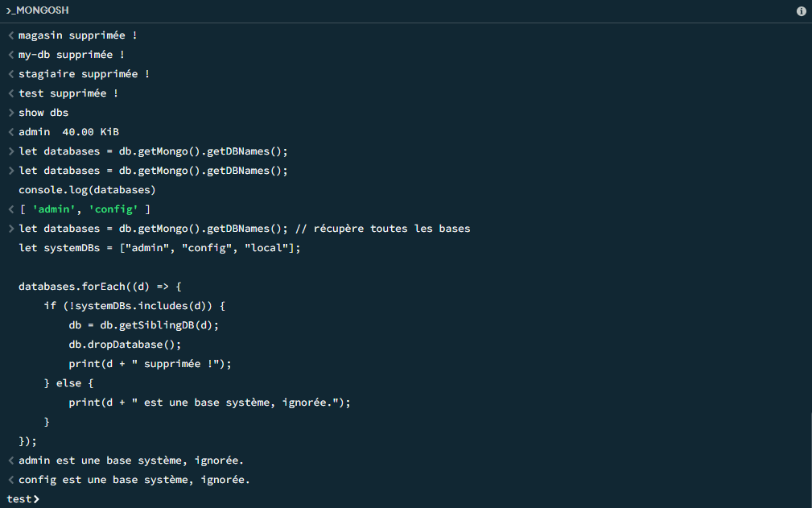

<p align="center">
  
</p>

<p align="center">
  
</p>


# MongoDB User Databases Cleaner

A simple and safe script to automatically delete all **user databases** in MongoDB while **ignoring system databases** like `admin`, `config`, and `local`.

---

## Description

Managing multiple MongoDB databases manually can be time-consuming and error-prone, especially when working on multiple projects or test environments.  
This script automates the deletion of all user databases safely, providing console messages for each database deleted or skipped.

---

## Script

```javascript
let systemDBs = ["admin", "config", "local"];
let databases = db.getMongo().getDBNames(); 

databases.forEach((d) => {
    if (!systemDBs.includes(d)) {
        db = db.getSiblingDB(d);
        db.dropDatabase();
        print(d + " deleted!");
    } else {
        print(d + " is a system database, skipped.");
    }
});
# mongo-db-cleaner

```

## Usage

1. Open the MongoDB shell (`mongosh`).  
2. Copy and paste the script directly, or save it as a `.js` file.  
3. Run the script to automatically delete all user databases.

**Example output:**

```
testDB deleted!
bibliotheque deleted!
admin is a system database, skipped.
```

---

## Warnings & Best Practices

- **Do not run this script on production databases without a backup.**  
- System databases (`admin`, `config`, `local`) are automatically ignored.  
- Always test the script on local or test databases before using it on important projects.
